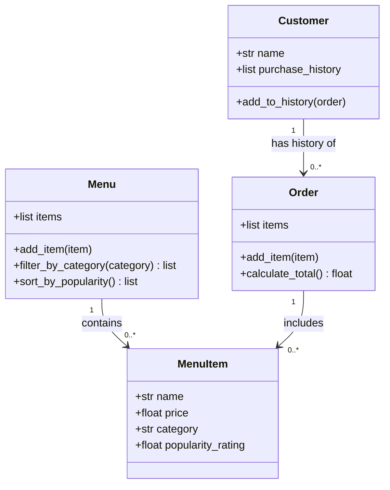

# ByteBites — Final UML Class Diagram

Refined using the ByteBites Design Agent. This diagram matches the client feature request exactly.

---

## Class Descriptions

| Class | Responsibility |
|-------|---------------|
| **Customer** | Represents a registered user with a name and a list of past orders for verification purposes. |
| **MenuItem** | Represents a single item available for purchase, described by name, price, category, and popularity. |
| **Menu** | Holds the full catalog of MenuItem objects and provides filtering and sorting capabilities. |
| **Order** | Groups selected MenuItems into a single transaction and computes the total cost. |

---

## Changes from Draft

- Removed `email`, `password`, `loyalty_points`, `is_verified` from Customer (not in spec).
- Removed `description`, `image_url` from MenuItem (not in spec).
- Removed `last_updated`, `is_active` from Menu (not in spec).
- Removed `order_id`, `timestamp`, `status`, `customer` reference from Order (not in spec).
- Removed all extra methods: `apply_discount`, `apply_tax`, `place_order`, `cancel_order`, etc.
- Added only `sort_by_popularity()` to Menu and `add_item()` to Menu and Order as minimal helpers.
